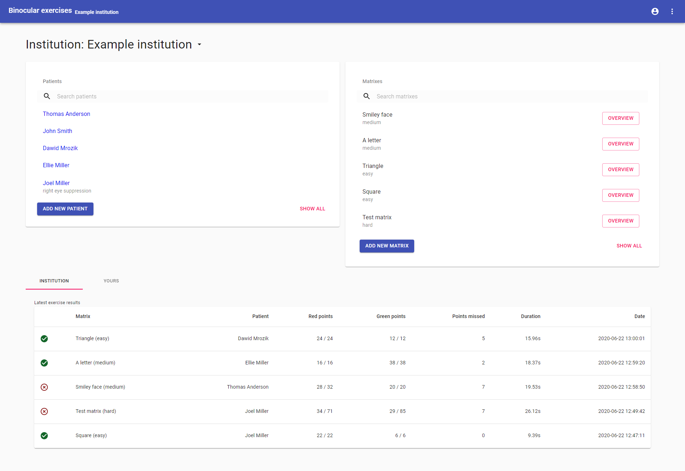

# Binocular exercises app

Application allows creating matrix with red/green points that can be solved by added to the system patients. Solving those matrixes are popular and effective binocular exercises. Red-green glasses are needed.

## Stack

- Backend - PHP/Slim
- Frontend - React with Redux and MaterialUI
- DB - MySQL
- ORM - Eloquent
- Migrations - Phinx

## Preview




### More screenshots of the application you can find in a preview folder of this repo.

## Running a project

For running this project you will need some database server, for example `MySQL`, `PHP` with `Composer` and `Node` with `NPM`.

First of all prepare your database and then change following files:

- phinx.yml.example -> phinx.yml
- /app/Config/Config.php.example -> /app/Config/Config.php

If you are in project root directory in your terminal you can run this commands:

```bash
cp phinx.yml.example phinx.yml
cp ./app/Config/Config.php.example ./app/Config/Config.php
```

Make sure you entered correct credentials in those files.

1. Install PHP dependencies:

```bash
composer install
```

2. Run migrations:

```bash
./vendor/bin/phinx migrate
```

3. Run server:

```bash
cd public
php -S localhost:8000
```

4. Install frontend dependencies:

```bash
cd client
npm install
```

5. Run React dev server:

```bash
cd client
npm start
```

> API will be available at [localhost:8000/api/v1](localhost:8000/api/v1) and client side at [localhost:3000](localhost:3000)
